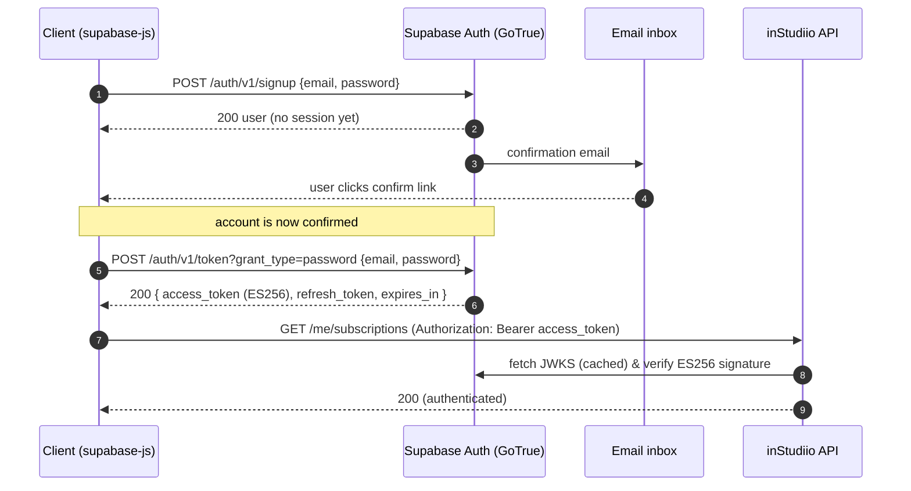

# Flow 1 — Authentication (get a token)

**Audience:** every client (web + iOS).
**Goal:** turn an email/password into a Supabase **access token (JWT)** you can
put on `Authorization: Bearer <token>` for the API.

> This flow talks to **Supabase**, not the inStudiio backend. The backend has no
> login/signup endpoint — it only *verifies* the token Supabase issues.

## Diagram



## Prerequisites

- Supabase project URL + **anon key** (see [README](./README.md#base-urls)).
- This project has **email confirmation ON** — new users must click the emailed
  link before they can sign in.

## Step by step

### 1. Sign up (first time only)

The canonical client call:

```ts
import { createClient } from '@supabase/supabase-js';
const supabase = createClient(SUPABASE_URL, SUPABASE_ANON_KEY);
await supabase.auth.signUp({ email, password });
```

Equivalent raw HTTP (what supabase-js does under the hood):

```bash
curl -X POST "https://iijhljehoqceownoeauu.supabase.co/auth/v1/signup" \
  -H "apikey: <anon key>" -H "Content-Type: application/json" \
  -d '{"email":"you@example.com","password":"yourpassword"}'
```

🟢 **REAL** — **200** (note: **no session is returned** — confirmation pending):

```json
{
  "id": "ebe69af9-6db5-4570-9b99-733c17c321b7",
  "email": "you@example.com",
  "confirmation_sent_at": "2026-06-17T02:59:24Z",
  "user_metadata": { "email_verified": false, "sub": "ebe69af9-…" }
}
```

### 2. Confirm the email

The user clicks the link Supabase emailed them. Until then, sign-in fails:

🟢 **REAL** — sign in before confirming → **400**:

```json
{ "code": 400, "error_code": "email_not_confirmed", "msg": "Email not confirmed" }
```

> The confirm link currently redirects to a placeholder site (`example.com`) — the
> redirect is broken but the **click still confirms the account**.

### 3. Sign in → get the token

```ts
await supabase.auth.signInWithPassword({ email, password });
const { data: { session } } = await supabase.auth.getSession();
const jwt = session?.access_token;   // ← the Bearer token
```

Raw HTTP:

```bash
curl -X POST "https://iijhljehoqceownoeauu.supabase.co/auth/v1/token?grant_type=password" \
  -H "apikey: <anon key>" -H "Content-Type: application/json" \
  -d '{"email":"you@example.com","password":"yourpassword"}'
```

🟢 **REAL** — **200**:

```json
{
  "access_token": "eyJhbGciOiJFUzI1NiIsImtpZCI6...",
  "token_type": "bearer",
  "expires_in": 3600,
  "refresh_token": "...",
  "user": { "id": "ebe69af9-…", "email": "you@example.com" }
}
```

🟢 **REAL** — wrong password → **400** `{"error_code":"invalid_credentials","msg":"Invalid login credentials"}`

### 4. Use the token on the API

```bash
curl https://in-studiio-backend.vercel.app/me/subscriptions \
  -H "Authorization: Bearer <access_token>"
```

🟢 **REAL** — **200** `{"subscriptions":[]}` (authenticated; empty for a new user).

Failure modes from the API:

| Status | `code` | When |
|---|---|---|
| 401 | `unauthorized` | missing/malformed header → `"Missing or malformed Authorization header"` |
| 401 | `unauthorized` | bad/expired token → `"Invalid or expired token"` |

## Notes & gotchas

- **Tokens expire in 1 hour** (`expires_in: 3600`). On a 401, refresh via the
  Supabase client (`supabase.auth.refreshSession()` / automatic refresh) and
  retry — don't bounce the user to login on the first 401.
- **Prod tokens are ES256.** The backend verifies them against the project's JWKS
  (`/auth/v1/.well-known/jwks.json`) and also accepts legacy HS256. You don't do
  anything special — the `access_token` is used verbatim.
- **No `GET /me`.** You already know the user from the Supabase session. Ask the
  backend "what do I own / subscribe to" via `GET /me/studios` /
  `GET /me/subscriptions`.
- **`scripts/mint-test-subscriber.ts` is local-testing only** — it signs a token
  directly with the JWT secret and refuses to run against prod. Not how the app
  authenticates.

**Next:** [Flow 2 — Subscribe & Watch](./02-subscribe-and-watch.md) ·
[Flow 3 — Owner Upload](./03-owner-upload.md)
