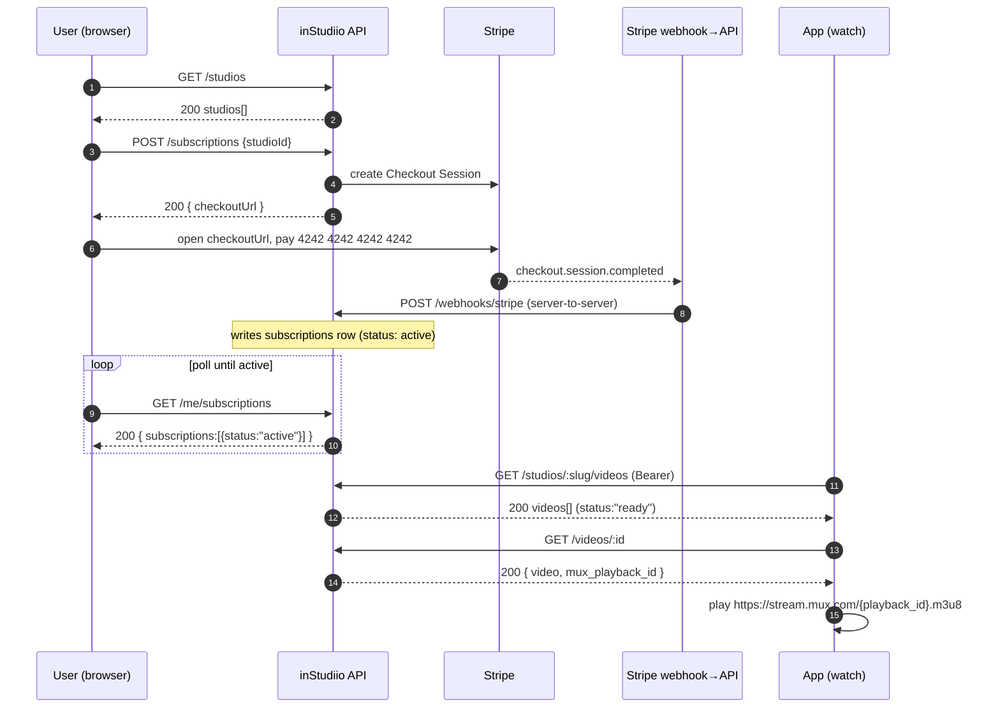
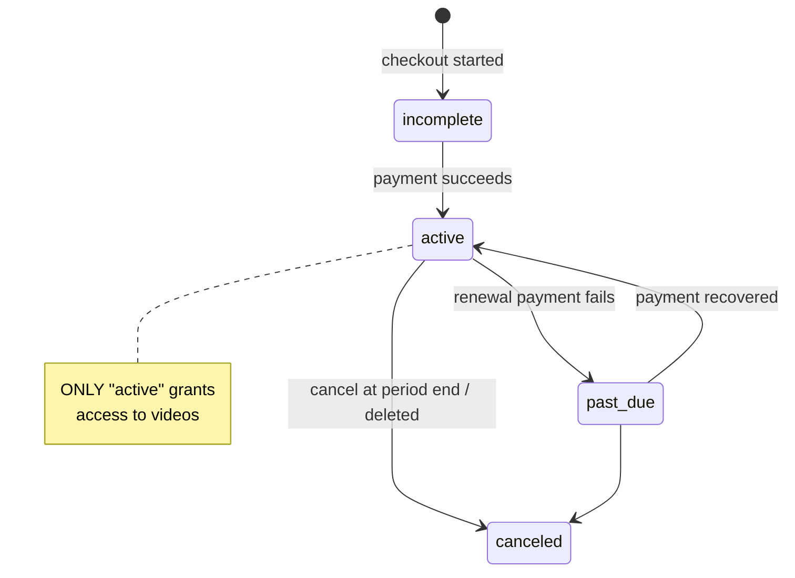

# Flow 2 — Subscribe & Watch

**Audience:** the subscriber-facing client (subscribe happens on the **web**;
watching happens in the **iOS app** or web).
**Goal:** browse studios, subscribe to one, and watch its videos.

**Prerequisite:** an access token — see [Flow 1 — Authentication](./01-authentication.md).

> **Why subscribe on the web?** By design — the iOS app only logs in and plays;
> the purchase happens in a browser via Stripe Checkout. See
> [`../PAYMENTS_MODEL_TRADEOFFS.md`](../PAYMENTS_MODEL_TRADEOFFS.md).

## Diagram



### Subscription status (entitlement)



## Step by step

### 1. Browse studios — `GET /studios`  *(public, no auth)*

```bash
curl "https://in-studiio-backend.vercel.app/studios?limit=20&offset=0"
```

🟢 **REAL** — **200**:

```json
{
  "studios": [
    { "id": "c4b33530-473b-40f4-9efd-eb9297a60b47", "name": "Test Studio",
      "slug": "test", "description": null, "price_monthly": 9.99,
      "created_at": "2026-05-29T22:24:33.035239+00:00" }
  ],
  "pagination": { "limit": 20, "offset": 0, "total": 1 }
}
```

Keep each studio's `id` (to subscribe) and `slug` (to list videos). Query:
`limit` 1–100 (default 20), `offset` ≥0. There is **no `GET /studios/:slug`**.

### 2. Create a checkout session — `POST /subscriptions`  *(auth required)*

```bash
curl -X POST https://in-studiio-backend.vercel.app/subscriptions \
  -H "Authorization: Bearer $JWT" -H "Content-Type: application/json" \
  -d '{"studioId":"c4b33530-473b-40f4-9efd-eb9297a60b47"}'
```

🟢 **REAL** — **200** (live **test-mode** session — note `cs_test_`):

```json
{ "checkoutUrl": "https://checkout.stripe.com/c/pay/cs_test_a11SkL9souqWh2eFCCU0Igx2lIShOIIK…" }
```

Redirect the browser: `window.location.href = checkoutUrl`.

| Status | `code` | When |
|---|---|---|
| 400 | `invalid_body` | `studioId` missing / not a UUID (🟢 real: `"Invalid UUID"`) |
| 401 | `unauthorized` | missing/expired JWT |
| 404 | `studio_not_found` | no such studio, or it has no Stripe price |
| 409 | `already_subscribed` | already has an `active`/`past_due`/`incomplete` sub here |
| 502 | `stripe_error` | Stripe unreachable — safe to retry |

### 3. Pay on Stripe — *(browser, on Stripe's page)*

Test card `4242 4242 4242 4242`, any future expiry, any CVC, any ZIP. After
payment Stripe redirects to `/subscribe/success?session_id=…`; on cancel,
`/subscribe/cancel` (small pages the backend serves).

### 4. Webhook writes the row — ⛔ `POST /webhooks/stripe`  *(server-only — you never call this)*

Stripe calls it directly with a signed, raw-body payload; it writes/updates the
`subscriptions` row. A client call has no valid signature and is rejected.

> ⚠️ **Prod caveat:** the prod Stripe **test-mode webhook is not registered yet**,
> so on the deployed URL this step never fires and the row is never written — the
> poll in step 5 stays empty. Demo the **full** loop locally with
> `stripe listen --forward-to localhost:3000/webhooks/stripe`
> ([`../FRONTEND_LOCAL_SETUP.md`](../FRONTEND_LOCAL_SETUP.md) §6).

### 5. Poll until entitled — `GET /me/subscriptions`  *(auth required)*

```bash
curl https://in-studiio-backend.vercel.app/me/subscriptions \
  -H "Authorization: Bearer $JWT"
```

🟢 **REAL** — **200**, fresh account, no sub yet (`Cache-Control: no-store`):

```json
{ "subscriptions": [] }
```

🧪 **REPRESENTATIVE** — once the webhook has written a row:

```json
{
  "subscriptions": [
    { "id": "9f1c0e2a-7b6d-4c3e-8a11-2d4f5a6b7c8d", "status": "active",
      "current_period_start": "2026-06-16T18:00:00.000Z",
      "current_period_end": "2026-07-16T18:00:00.000Z",
      "cancel_at_period_end": false,
      "studio": { "id": "c4b33530-473b-40f4-9efd-eb9297a60b47", "name": "Test Studio",
        "slug": "test", "description": null, "price_monthly": 9.99,
        "created_at": "2026-05-29T22:24:33.035239+00:00" } }
  ]
}
```

Poll every ~1.5s for ~10s until a row with `status:"active"` for the studio
appears. **Only `status:"active"` grants video access.** Filters:
`?status=active`, `?studio_id=<uuid>`. Single sub: `GET /me/subscriptions/:id` →
`{ "subscription": {…} }` or **404 `subscription_not_found`**.

### 6. (optional) Cancel — `DELETE /subscriptions/:id`  *(auth required)*

Pass the **subscription's** id (from step 5), not the studio id.

🧪 **REPRESENTATIVE** — **200** `{ "canceled": true, "cancelAtPeriodEnd": true }`

Cancel is **at period end**: access continues until `current_period_end`;
`cancel_at_period_end` flips to `true` now, `status` stays `active` until the
period ends. Errors: 404 `subscription_not_found`, 409 `not_cancelable`.

### 7. List videos — `GET /studios/:slug/videos`  *(auth: active sub or owner)*

```bash
curl "https://in-studiio-backend.vercel.app/studios/test/videos?limit=20" \
  -H "Authorization: Bearer $JWT"
```

🟢 **REAL** — not subscribed → **403**:

```json
{ "error": { "code": "forbidden", "message": "subscription required" } }
```

🧪 **REPRESENTATIVE** — subscribed → **200**:

```json
{
  "videos": [
    { "id": "b2e7d9a4-1f3c-4a8e-9c12-7d6e5f4a3b2c", "studio_id": "c4b33530-…",
      "title": "Episode 1", "description": "Warm-up flow", "status": "ready",
      "mux_playback_id": "AbCdEf01gHiJkLmN02oPqRsT", "duration_seconds": 612.3,
      "error_message": null, "created_at": "2026-06-16T18:05:00.000Z" }
  ],
  "nextCursor": null
}
```

Subscribers see only `status:"ready"`. Paging: if `videos.length === limit`, pass
`nextCursor` back as `?cursor=`; `null` = end.

### 8. Get one video — `GET /videos/:id`  *(auth: active sub or owner)*

🟢 **REAL** — not entitled (or doesn't exist) → **404** *(not 403 — it won't even
confirm existence)*: `{ "error": { "code": "not_found", "message": "video not found" } }`

🟢 **REAL** — malformed id → **400** `{"error":{"code":"bad_request","message":"invalid video id"}}`

🧪 **REPRESENTATIVE** — entitled → **200** `{ "video": { …same fields as the list… } }`

### 9. Play — HLS

```
https://stream.mux.com/{mux_playback_id}.m3u8
```

Hand to your HLS player (AVPlayer on iOS, hls.js / `<video>` on web). Playback
policy is **public** — no signed token. `mux_playback_id === null` → not `ready`,
don't play.

## Caveats

- **Completing a subscription is blocked in prod** until the Stripe webhook is
  registered (step 4). Everything up to "create checkout URL" works live.
- **Web CORS:** `CORS_ORIGINS`/`APP_ORIGIN` are placeholder `example.com`; a
  browser frontend won't pass CORS until set. iOS app + curl/Postman unaffected.

**Prev:** [Flow 1 — Authentication](./01-authentication.md) ·
**Next:** [Flow 3 — Owner Upload](./03-owner-upload.md)
