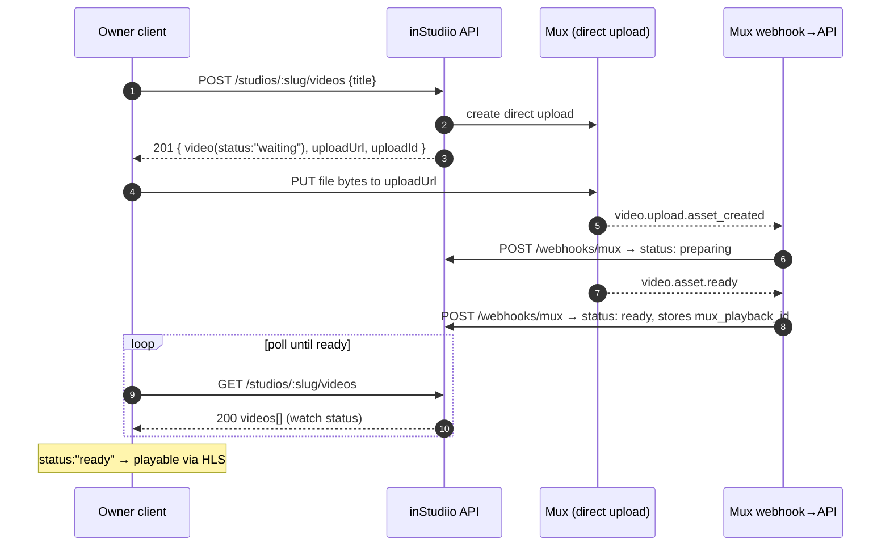
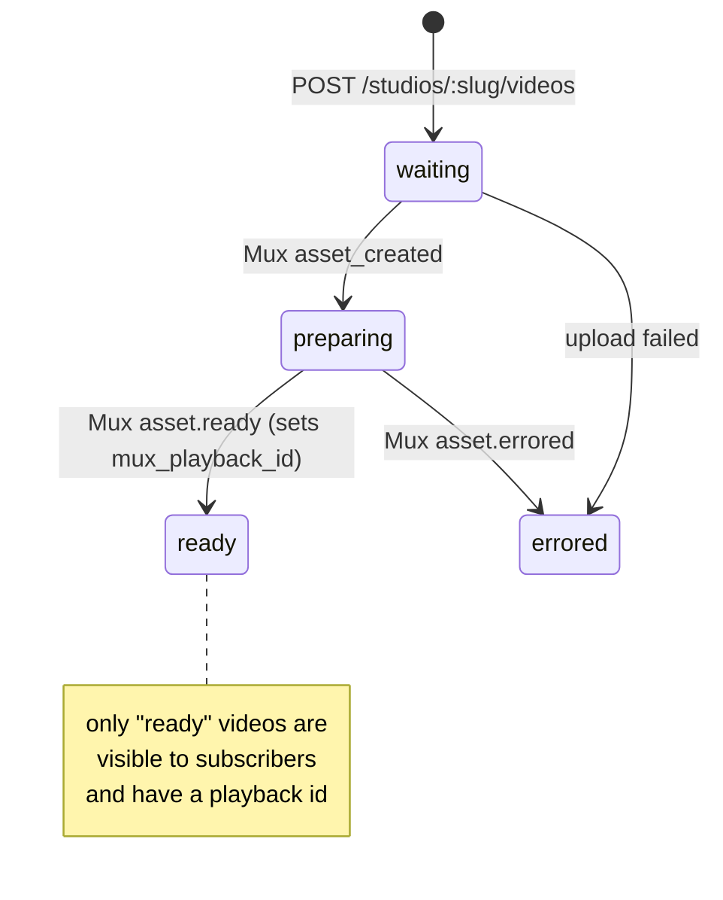

# Flow 3 — Owner Upload

**Audience:** the studio-owner client.
**Goal:** upload a video to a studio you own and get it to a playable `ready`
state.

**Prerequisites:**
- An access token for an **owner** account — see [Flow 1](./01-authentication.md).
- You must **own the studio** (`studios.owner_user_id === your user id`). Studios
  are created by an operator — see [Flow 4 — Studio Onboarding](./04-studio-onboarding.md).
- Confirm what you own: `GET /me/studios` → `{ "studios": [...] }` (🟢 real for a
  non-owner: **200** `{"studios":[]}`).

> Upload is **two hops**: you ask the backend for a one-time Mux upload URL, then
> you send the file bytes **straight to Mux** (not through this backend). Mux then
> notifies the backend when the video is ready.

## Diagram



### Video lifecycle (status)



## Step by step

### 1. Create the upload — `POST /studios/:slug/videos`  *(auth: owner only)*

Body: `{ "title": string (1–200), "description"?: string (≤5000) }`.

```bash
curl -X POST https://in-studiio-backend.vercel.app/studios/test/videos \
  -H "Authorization: Bearer $OWNER_JWT" -H "Content-Type: application/json" \
  -d '{"title":"Episode 1","description":"Warm-up flow"}'
```

🧪 **REPRESENTATIVE** — **201** (needs an owner of studio `test` to capture live):

```json
{
  "video": {
    "id": "b2e7d9a4-1f3c-4a8e-9c12-7d6e5f4a3b2c",
    "studio_id": "c4b33530-473b-40f4-9efd-eb9297a60b47",
    "title": "Episode 1", "description": "Warm-up flow",
    "status": "waiting", "mux_playback_id": null,
    "duration_seconds": null, "error_message": null,
    "created_at": "2026-06-16T18:05:00.000Z"
  },
  "uploadUrl": "https://storage.googleapis.com/video-storage-gcp-…/upload?…",
  "uploadId": "00abc123MuxUploadId"
}
```

| Status | `code` | When |
|---|---|---|
| 400 | `bad_request` | title missing/empty or >200 chars |
| 401 | `unauthorized` | missing/expired JWT |
| 403 | `forbidden` | authenticated but **not the owner** of this studio |
| 404 | `not_found` | no studio with that slug |
| 502 | `upstream_unavailable` | Mux was unreachable |

### 2. Send the file to Mux — `PUT <uploadUrl>`  *(to Mux, not us)*

```bash
curl -X PUT "<uploadUrl>" -H "Content-Type: video/mp4" --data-binary @episode1.mp4
```

In a browser, `PUT` the `File`/`Blob`. A `200`/`204` from Mux means the bytes
landed. `uploadUrl` is single-use.

### 3. Mux webhook advances the row — ⛔ `POST /webhooks/mux`  *(server-only)*

Mux fires events as it processes the asset; the backend advances `status`:
`waiting → preparing → ready` (or `errored`), and on `ready` stores
`mux_playback_id` + `duration_seconds`. **You never call this** — it's signed by
Mux and mounted on the raw request body.

### 4. Poll until ready — `GET /studios/:slug/videos`  *(auth: owner)*

Owners see **all** statuses (subscribers only see `ready`), so you can watch your
own pipeline:

```bash
curl "https://in-studiio-backend.vercel.app/studios/test/videos?limit=20" \
  -H "Authorization: Bearer $OWNER_JWT"
```

Wait for `status:"ready"` and a non-null `mux_playback_id`. Then it's playable via
`https://stream.mux.com/{mux_playback_id}.m3u8` (see [Flow 2 §9](./02-subscribe-and-watch.md)).

### Editing & deleting

| Endpoint | Auth | Body / result |
|---|---|---|
| `PATCH /videos/:id` | owner | `{ title?, description? }` (≥1 required) → **200** `{ "video": {…} }` |
| `DELETE /videos/:id` | owner | → **204** No Content (also deletes the Mux asset) |

🟢 **REAL** (auth verified live) — `GET /videos/<random uuid>` as non-owner/non-sub
→ **404** `{"error":{"code":"not_found","message":"video not found"}}`;
`GET /videos/<bad uuid>` → **400** `{"error":{"code":"bad_request","message":"invalid video id"}}`.

## Caveats

- **Owner account needs a password.** The onboarding script creates owners with
  *no* password (admin API). To sign in as an owner, sign that email up with a
  password (and confirm it) **before or after** onboarding — see
  [Flow 4](./04-studio-onboarding.md).
- **Reaching `ready` in prod depends on the Mux webhook.** If Mux's webhook isn't
  pointed at the prod URL, uploaded videos stay `waiting`/`preparing` forever
  (owners still see the row; it just never becomes playable). Verify the Mux
  webhook destination before relying on prod upload end-to-end.

**Prev:** [Flow 2 — Subscribe & Watch](./02-subscribe-and-watch.md) ·
**Next:** [Flow 4 — Studio Onboarding](./04-studio-onboarding.md)
