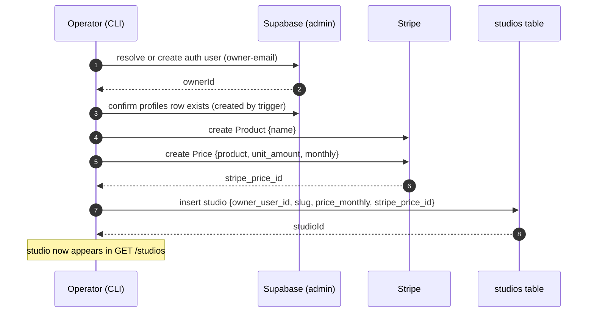

# Flow 4 — Studio Onboarding

**Audience:** an operator / the backend team.
**Goal:** register a studio in production (create its owner, Stripe product/price,
and the `studios` row).

> **This is not an API endpoint.** Studios are created by a **CLI script** run
> with privileged (service-role + Stripe) credentials — there is intentionally no
> public "create studio" route.

## Diagram



## The command

```bash
pnpm onboard:studio \
  --owner-email=owner@example.com \
  --name="Some Studio" \
  --slug=some-studio \
  --price=9.99 \
  --description="optional blurb"
```

| Flag | Required | Notes |
|---|---|---|
| `--owner-email` | ✅ | the studio owner's email (resolved or created in Supabase) |
| `--name` | ✅ | studio display name (also the Stripe product name) |
| `--slug` | ✅ | URL slug, must match `^[a-z0-9-]+$`; unique |
| `--price` | — | monthly USD, default `9.99` |
| `--description` | — | optional |

On success it prints the `studioId`, `slug`, owner id, and the Stripe
product/price ids.

## What it does (`src/scripts/onboardStudio.ts`)

1. **Resolve or create the owner** — looks up the email via the Supabase admin
   API; creates the auth user (`email_confirm: true`) if missing.
2. **Confirm the `profiles` row** exists (a DB trigger populates it on user
   creation) — fails loudly if not.
3. **Create a Stripe Product** named after the studio.
4. **Create a recurring monthly Stripe Price** (`unit_amount = price × 100`, USD).
5. **Insert the `studios` row** with `owner_user_id`, `slug`, `price_monthly`,
   `stripe_product_id`, `stripe_price_id`. Duplicate slug → clear error.

## Targeting production

The script reads its credentials from the environment via `src/supabase.ts` /
`src/stripe.ts`:

- `SUPABASE_URL`, `SUPABASE_SERVICE_ROLE_KEY` — the prod Supabase project
- `STRIPE_SECRET_KEY` — prod Stripe (currently **test mode**, `sk_test_…`)

So to onboard **into prod**, run it with the prod values loaded (they live in
`.env.production`). For example, point your env at prod for a single run.

> ⚠️ **No production guard.** Unlike `mint-test-subscriber.ts`, the onboarding
> script does **not** refuse to run against prod — it writes to whatever env you
> give it (real Supabase rows + a real Stripe product/price). Be deliberate about
> which environment is loaded.

## ⚠️ The owner-password gotcha (important for testing the upload flow)

The script creates the owner via the admin API **with no password**. That owner
**cannot sign in via password grant**, so they can't get a token to call
`POST /studios/:slug/videos`.

To get an owner you can actually log in as, do one of:

- **Recommended:** [sign up](./01-authentication.md) the owner email **with a
  password** and confirm it, **then** run `onboard:studio` with that same email —
  the script reuses the existing user (now it has both a studio and a password).
- Or: onboard first, then set a password via a Supabase password-reset / admin
  update for that user.

## Verify

After onboarding, the studio is publicly listable:

```bash
curl "https://in-studiio-backend.vercel.app/studios"
```

🟢 **REAL** (existing prod studio) — **200** includes:

```json
{ "id": "c4b33530-473b-40f4-9efd-eb9297a60b47", "name": "Test Studio",
  "slug": "test", "price_monthly": 9.99, ... }
```

The owner can then confirm ownership with `GET /me/studios` and proceed to
[Flow 3 — Owner Upload](./03-owner-upload.md).

**Prev:** [Flow 3 — Owner Upload](./03-owner-upload.md) ·
[Back to index](./README.md)
